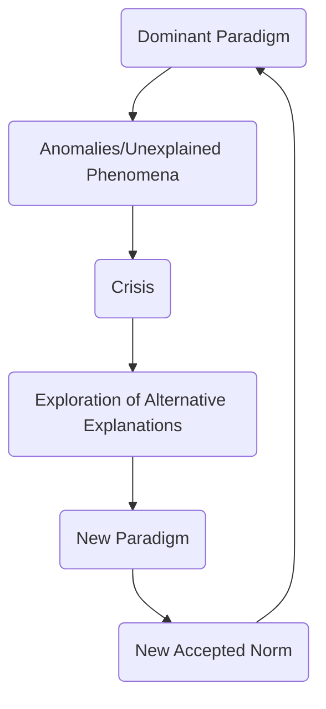

---
{"dg-publish":true,"permalink":"/02-working-on/atomic-notes/kuhn-cycle/","title":"Kuhn Cycle","noteIcon":"","created":"Monday, December 18th 2023, 1:41:17 pm","updated":"2024-02-15T19:08:16.729+01:00"}
---

- The Kuhn Cycle, proposed by philosopher Thomas Kuhn, provides a model for understanding how scientific paradigms and theories evolve over time.
- According to Kuhn, scientific communities operate within a dominant paradigm, which represents a widely accepted theoretical framework and research methodology.

Basically it works like this

- However, as researchers encounter anomalies or unexplained phenomena within the dominant paradigm, a crisis ensues, leading to the exploration of alternative explanations.
- This crisis stage prompts the examination of different perspectives and the development of new theories or paradigms.
- Eventually, a new paradigm emerges that better explains the previously unexplained phenomena and becomes the new accepted norm.
- The cycle of paradigm shifts continues as new theories continually challenge and replace older ones, driving the advancement of knowledge.
- As an urban planner, you can use the Kuhn Cycle to understand the evolution of planning theories and practices over time.
- It helps you recognize that the field of urban planning is not static and that new ideas and approaches may emerge to address changing urban challenges.
- By understanding the Kuhn Cycle, you can be open to challenging existing paradigms and exploring alternative perspectives in your planning work.
- It encourages you to critically evaluate the dominant paradigms in urban planning and consider new theories or approaches that may better address the complexities of urban environments.
- Embracing the Kuhn Cycle allows you to adapt and evolve as an urban planner, continually seeking innovative and effective solutions for urban development and management.